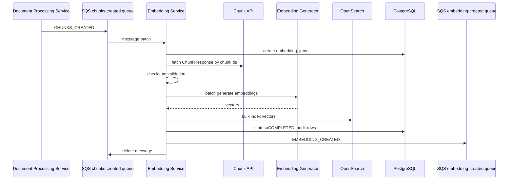
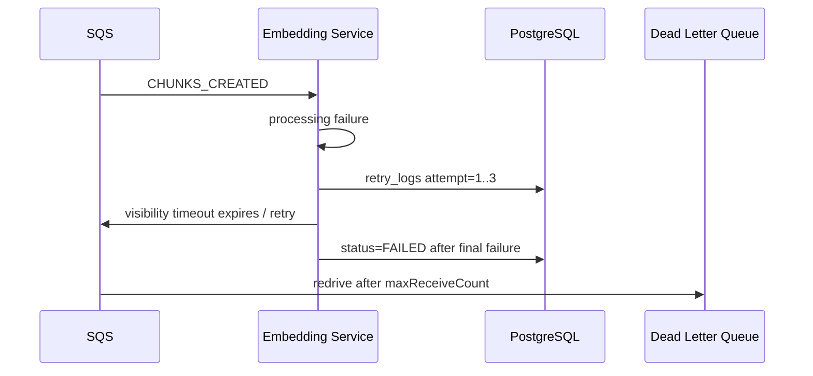
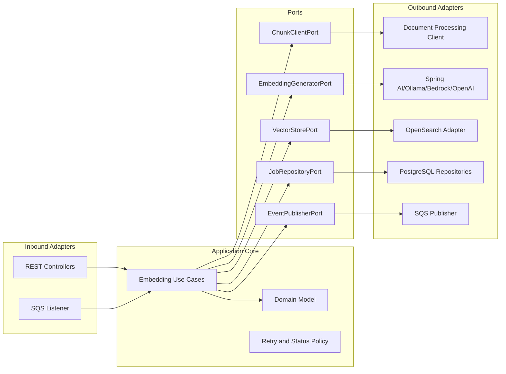

# Embedding Service Architecture

## 1. High-Level Architecture

The Embedding Service is a Spring Boot microservice responsible only for chunk embedding lifecycle work:

1. Consume `CHUNKS_CREATED` events from Amazon SQS.
2. Fetch chunk details from the Document Processing Service.
3. Validate chunk integrity using checksum.
4. Generate embeddings through a configurable embedding provider.
5. Store vector documents in OpenSearch index `document_embeddings`.
6. Store operational metadata in PostgreSQL.
7. Update embedding status.
8. Publish `EMBEDDING_CREATED` events to SQS/EventBridge-compatible publisher.

It does not parse PDFs, perform OCR, extract text, split chunks, or upload documents.

Target stack:

- Java 21
- Spring Boot 3.x
- Maven
- Spring AI
- PostgreSQL
- OpenSearch Java Client
- AWS SDK v2 for SQS/S3-compatible AWS auth primitives
- Spring Retry and Resilience4j
- Micrometer, Prometheus, Grafana
- OpenAPI/Swagger
- Testcontainers, JUnit 5, Mockito

Implementation note: the project is aligned to Spring Boot 3.x in `pom.xml`.

## 2. Runtime Flow



Failure flow:



## 3. Hexagonal Component Design



Core use cases:

- `CreateEmbeddingUseCase`: process one chunk.
- `CreateBatchEmbeddingsUseCase`: process many chunks from API or event.
- `HandleChunksCreatedEventUseCase`: idempotent event-driven orchestration.
- `GetEmbeddingStatusUseCase`: read operational status from PostgreSQL.
- `DeleteEmbeddingUseCase`: delete vector from OpenSearch and mark status.
- `RepublishEmbeddingEventUseCase`: operational recovery.

## 4. Package Structure

```text
com.company.embedding
  config
    AwsConfig
    OpenSearchConfig
    EmbeddingModelConfig
    RetryConfig
    ResilienceConfig
    SecurityConfig
    ThreadPoolConfig
    OpenApiConfig
  controller
    EmbeddingController
    StatusController
    HealthController
  service
    EmbeddingCommandService
    EmbeddingQueryService
  service.impl
    EmbeddingCommandServiceImpl
    EmbeddingQueryServiceImpl
  domain
    EmbeddingJob
    EmbeddingStatus
    EmbeddingVector
    RetryPolicy
    FailureReason
  port
    inbound
      CreateEmbeddingUseCase
      CreateBatchEmbeddingsUseCase
      HandleChunksCreatedEventUseCase
      QueryEmbeddingUseCase
      DeleteEmbeddingUseCase
    outbound
      ChunkClientPort
      EmbeddingGeneratorPort
      VectorStorePort
      EventPublisherPort
      EmbeddingJobStorePort
      AuditStorePort
  adapter
    inbound
      sqs
        ChunksCreatedListener
      rest
        EmbeddingRestAdapter
    outbound
      chunk
        DocumentProcessingClient
      embedding
        SpringAiEmbeddingAdapter
        OllamaEmbeddingAdapter
        BedrockTitanEmbeddingAdapter
        OpenAiEmbeddingAdapter
      opensearch
        OpenSearchVectorAdapter
        OpenSearchBulkIndexer
      sqs
        SqsEventPublisher
      persistence
        JpaEmbeddingJobRepositoryAdapter
  dto
    ChunkResponse
    CreateEmbeddingRequest
    BatchEmbeddingRequest
    EmbeddingResponse
    ErrorResponse
    StatusResponse
  entity
    EmbeddingJobEntity
    EmbeddingStatusEntity
    EmbeddingAuditEntity
    RetryLogEntity
    FailureLogEntity
  repository
    EmbeddingJobJpaRepository
    EmbeddingStatusJpaRepository
    EmbeddingAuditJpaRepository
    RetryLogJpaRepository
    FailureLogJpaRepository
  mapper
    ChunkMapper
    EmbeddingMapper
    EntityMapper
  exception
    EmbeddingException
    ChunkFetchException
    ChecksumValidationException
    EmbeddingGenerationException
    VectorStoreException
    GlobalExceptionHandler
  event
    ChunksCreatedEvent
    EmbeddingCreatedEvent
    EventEnvelope
  vector
    VectorDocument
    VectorSearchRequest
    HybridSearchRequest
  client
    OpenSearchClientFactory
    SqsClientFactory
  util
    ChecksumValidator
    CorrelationId
    JsonUtils
  health
    OpenSearchHealthIndicator
    SqsHealthIndicator
    EmbeddingProviderHealthIndicator
  metrics
    EmbeddingMetrics
    OpenSearchMetrics
    SqsMetrics
```

## 5. Event Contracts

Inbound `CHUNKS_CREATED`:

```json
{
  "eventType": "CHUNKS_CREATED",
  "documentId": "3f951f5c-601c-45b8-9540-d7ec72a31e79",
  "chunkIds": [
    "3ecf450b-ee33-40ac-83f9-bc26d624f34a"
  ],
  "totalChunks": 1,
  "createdAt": "2026-07-27T10:00:00Z",
  "correlationId": "01J..."
}
```

Outbound `EMBEDDING_CREATED`:

```json
{
  "eventType": "EMBEDDING_CREATED",
  "documentId": "3f951f5c-601c-45b8-9540-d7ec72a31e79",
  "embeddingJobId": "9a9f1c50-a54d-4925-a232-9808680d15ef",
  "embeddingIds": [
    "9fd81e78-5b26-48fa-aebb-ad793960905e"
  ],
  "chunkIds": [
    "3ecf450b-ee33-40ac-83f9-bc26d624f34a"
  ],
  "embeddingModel": "text-embedding-3-small",
  "embeddingDimension": 1536,
  "status": "COMPLETED",
  "createdAt": "2026-07-27T10:01:30Z",
  "correlationId": "01J..."
}
```

Idempotency:

- Use `(document_id, chunk_id, embedding_model, checksum)` as the logical idempotency key.
- Reprocessing the same checksum/model updates operational metadata but must not create duplicate vector records.
- Changed checksum means a new version should be indexed and prior vectors marked superseded or deleted depending on retention policy.

## 6. Embedding Model Recommendation

| Model | Dimensions | Local memory | Accuracy | Performance | Cost | Best use |
|---|---:|---:|---|---|---|---|
| `sentence-transformers/all-MiniLM-L6-v2` | 384 | Low, about 1-2 GB | Good baseline | Fast CPU | Free local | Local dev, tests |
| `BAAI/bge-small-en-v1.5` | 384 | Low, about 1-2 GB | Better retrieval than MiniLM in many English workloads | Fast CPU/GPU | Free local | Local dev and free tier |
| `e5-small` | 384 | Low, about 1-2 GB | Good semantic search with query/passsage prefix discipline | Fast | Free local | Free tier |
| `BAAI/bge-base-en-v1.5` | 768 | Medium, about 3-5 GB | Stronger retrieval | Moderate | Free local | Higher-quality self-hosted |
| `e5-base` | 768 | Medium, about 3-5 GB | Strong retrieval | Moderate | Free local | Self-hosted production |
| `nomic-embed-text` | 768 | Medium, about 4-6 GB with Ollama | Good general retrieval | Good with Ollama | Free local | Local dev with Ollama |
| Amazon Titan Embeddings | commonly 1024 or configurable by model/version | No local memory | Strong managed option | Scales through Bedrock quotas | Paid per usage | AWS production |
| OpenAI `text-embedding-3-small` | 1536, can support shorter dimensions by API option | No local memory | Strong quality/cost ratio | High managed throughput | Paid per token | Production default outside strict AWS-only |

Recommended choices:

- Local development: `nomic-embed-text` through Ollama for developer ergonomics, or `bge-small-en-v1.5` for 384-dimensional low-resource tests.
- Free tier/self-hosted: `bge-small-en-v1.5` when memory and index size matter; `bge-base-en-v1.5` or `e5-base` when accuracy matters more than storage.
- Production: OpenAI `text-embedding-3-small` for quality/cost and operational simplicity, or Amazon Titan Embeddings when AWS-native networking, IAM, and data residency are the priority.

Tradeoffs:

- Higher dimensions usually improve recall but increase OpenSearch storage, RAM, indexing CPU, and query latency.
- 384-dimensional vectors are cheaper and faster at very large scale.
- 768-dimensional vectors are a strong self-hosted production compromise.
- 1536-dimensional managed embeddings usually improve quality but materially increase vector index size.
- For billions of embeddings, cost is dominated by vector storage, HNSW graph memory, shard count, reindexing, and query fan-out.

## 7. OpenSearch Index Design

Index name: `document_embeddings`

Core design:

- Store one OpenSearch document per embedded chunk.
- Use `knn_vector` for dense vector search.
- Store `content` as `text` for hybrid BM25 plus vector retrieval.
- Store identifiers and filters as `keyword`.
- Store dates as `date`.
- Store flexible enrichment data as `object`.
- Use cosine similarity for semantic retrieval.
- Use aliases for versioned index rollout: `document_embeddings_write`, `document_embeddings_read`.

### Field Type Rationale

| Field | Type | Reason |
|---|---|---|
| `embeddingId`, `chunkId`, `documentId` | `keyword` | Exact lookups, filters, joins to operational metadata |
| `content`, `title`, `section` | `text` | Full-text search and hybrid retrieval |
| `language`, `source`, `embeddingModel`, `checksum` | `keyword` | Filtering, aggregations, idempotency |
| `embeddingDimension`, `pageNumber`, `chunkOrder` | numeric | Range and sort/filter support |
| `metadata` | `object` | Flexible chunk metadata without relational coupling |
| `embedding` | `knn_vector` | Approximate nearest-neighbor search |
| `createdAt`, `updatedAt` | `date` | Retention, sorting, lifecycle policies |

### Create Index Request

For `text-embedding-3-small` use dimension `1536`. For `bge-small` or MiniLM use `384`; for `bge-base`, `e5-base`, or `nomic-embed-text` use `768`. Dimension is immutable, so create a new index version per dimension/model family.

```http
PUT /document_embeddings_v1
Content-Type: application/json

{
  "settings": {
    "index": {
      "knn": true,
      "number_of_shards": 12,
      "number_of_replicas": 1,
      "refresh_interval": "30s",
      "codec": "best_compression",
      "knn.algo_param.ef_search": 128
    },
    "analysis": {
      "analyzer": {
        "rag_content_analyzer": {
          "type": "custom",
          "tokenizer": "standard",
          "filter": ["lowercase", "asciifolding", "stop"]
        }
      }
    }
  },
  "mappings": {
    "dynamic": false,
    "properties": {
      "embeddingId": { "type": "keyword" },
      "chunkId": { "type": "keyword" },
      "documentId": { "type": "keyword" },
      "chunkOrder": { "type": "integer" },
      "content": {
        "type": "text",
        "analyzer": "rag_content_analyzer",
        "fields": {
          "keyword": {
            "type": "keyword",
            "ignore_above": 256
          }
        }
      },
      "embedding": {
        "type": "knn_vector",
        "dimension": 1536,
        "method": {
          "name": "hnsw",
          "space_type": "cosinesimil",
          "engine": "faiss",
          "parameters": {
            "ef_construction": 256,
            "m": 32
          }
        }
      },
      "embeddingModel": { "type": "keyword" },
      "embeddingDimension": { "type": "integer" },
      "pageNumber": { "type": "integer" },
      "section": {
        "type": "text",
        "analyzer": "rag_content_analyzer",
        "fields": {
          "keyword": { "type": "keyword", "ignore_above": 256 }
        }
      },
      "title": {
        "type": "text",
        "analyzer": "rag_content_analyzer",
        "fields": {
          "keyword": { "type": "keyword", "ignore_above": 256 }
        }
      },
      "language": { "type": "keyword" },
      "source": { "type": "keyword" },
      "parentChunkId": { "type": "keyword" },
      "metadata": {
        "type": "object",
        "enabled": true
      },
      "checksum": { "type": "keyword" },
      "createdAt": { "type": "date" },
      "updatedAt": { "type": "date" }
    }
  },
  "aliases": {
    "document_embeddings_read": {},
    "document_embeddings_write": {
      "is_write_index": true
    }
  }
}
```

### KNN Search

```http
POST /document_embeddings_read/_search
Content-Type: application/json

{
  "size": 20,
  "query": {
    "bool": {
      "filter": [
        { "term": { "language": "en" } },
        { "term": { "documentId": "3f951f5c-601c-45b8-9540-d7ec72a31e79" } }
      ],
      "must": [
        {
          "knn": {
            "embedding": {
              "vector": [0.01, 0.02],
              "k": 20
            }
          }
        }
      ]
    }
  },
  "_source": {
    "excludes": ["embedding"]
  }
}
```

### Hybrid Search

```http
POST /document_embeddings_read/_search
Content-Type: application/json

{
  "size": 20,
  "query": {
    "bool": {
      "filter": [
        { "term": { "language": "en" } },
        { "range": { "pageNumber": { "gte": 1, "lte": 50 } } }
      ],
      "should": [
        {
          "match": {
            "content": {
              "query": "refund policy eligibility",
              "boost": 0.35
            }
          }
        },
        {
          "knn": {
            "embedding": {
              "vector": [0.01, 0.02],
              "k": 100,
              "boost": 0.65
            }
          }
        }
      ],
      "minimum_should_match": 1
    }
  },
  "_source": {
    "excludes": ["embedding"]
  }
}
```

### Bulk Indexing Strategy

- Use OpenSearch Bulk API via official OpenSearch Java Client.
- Batch by count and payload size: start with `500` chunks or `5-10 MB`, whichever comes first.
- Use deterministic document ID: `{chunkId}:{embeddingModel}:{checksum}`.
- Disable immediate refresh during ingestion with `refresh_interval=30s` or higher.
- Use exponential backoff for `429`, `503`, and connection failures.
- Split failed bulk responses into retryable and permanent failures.
- Record per-chunk failures in `failure_logs`.

Example:

```http
POST /_bulk
Content-Type: application/x-ndjson

{ "index": { "_index": "document_embeddings_write", "_id": "chunk:model:checksum" } }
{ "embeddingId": "9fd81e78-5b26-48fa-aebb-ad793960905e", "chunkId": "3ecf450b-ee33-40ac-83f9-bc26d624f34a", "documentId": "3f951f5c-601c-45b8-9540-d7ec72a31e79", "content": "chunk text", "embedding": [0.01, 0.02], "embeddingModel": "text-embedding-3-small", "embeddingDimension": 1536, "language": "en", "checksum": "sha256:...", "createdAt": "2026-07-27T10:01:30Z" }
```

### Shards, Replicas, and Lifecycle

Initial production defaults:

- Small/medium cluster: `6` primary shards, `1` replica.
- Large ingestion cluster: `12-24` primary shards, `1-2` replicas.
- Billions of embeddings: partition by tenant or time/model using versioned indices and aliases; avoid one unbounded physical index forever.

Lifecycle:

- `document_embeddings_v{n}` per mapping/model dimension change.
- Use rollover aliases when index reaches shard-size targets, for example `30-50 GB` per shard depending on hardware and latency goals.
- Keep hot indices on vector-optimized nodes.
- Use snapshots to S3.
- Delete or archive vectors for deleted documents through async tombstone processing.

## 8. PostgreSQL Operational Schema

PostgreSQL stores status, attempts, failures, and audit records only. Vectors are never stored in PostgreSQL.

```sql
CREATE TABLE embedding_jobs (
    id UUID PRIMARY KEY,
    document_id UUID NOT NULL,
    event_id VARCHAR(128),
    total_chunks INTEGER NOT NULL CHECK (total_chunks >= 0),
    requested_chunks INTEGER NOT NULL CHECK (requested_chunks >= 0),
    completed_chunks INTEGER NOT NULL DEFAULT 0 CHECK (completed_chunks >= 0),
    failed_chunks INTEGER NOT NULL DEFAULT 0 CHECK (failed_chunks >= 0),
    embedding_model VARCHAR(128) NOT NULL,
    embedding_dimension INTEGER NOT NULL CHECK (embedding_dimension > 0),
    status VARCHAR(32) NOT NULL CHECK (status IN ('PENDING','PROCESSING','COMPLETED','PARTIAL_FAILED','FAILED','CANCELLED')),
    correlation_id VARCHAR(128),
    created_at TIMESTAMPTZ NOT NULL,
    updated_at TIMESTAMPTZ NOT NULL,
    completed_at TIMESTAMPTZ
);

CREATE TABLE embedding_status (
    id UUID PRIMARY KEY,
    job_id UUID NOT NULL REFERENCES embedding_jobs(id) ON DELETE CASCADE,
    document_id UUID NOT NULL,
    chunk_id UUID NOT NULL,
    embedding_id UUID,
    embedding_model VARCHAR(128) NOT NULL,
    embedding_dimension INTEGER NOT NULL,
    checksum VARCHAR(256) NOT NULL,
    status VARCHAR(32) NOT NULL CHECK (status IN ('PENDING','PROCESSING','COMPLETED','FAILED','SKIPPED','DELETED')),
    opensearch_index VARCHAR(128),
    opensearch_document_id VARCHAR(512),
    attempt_count INTEGER NOT NULL DEFAULT 0 CHECK (attempt_count >= 0),
    error_code VARCHAR(128),
    error_message TEXT,
    created_at TIMESTAMPTZ NOT NULL,
    updated_at TIMESTAMPTZ NOT NULL,
    completed_at TIMESTAMPTZ,
    UNIQUE (chunk_id, embedding_model, checksum)
);

CREATE TABLE embedding_audit (
    id UUID PRIMARY KEY,
    job_id UUID REFERENCES embedding_jobs(id) ON DELETE SET NULL,
    chunk_id UUID,
    document_id UUID,
    action VARCHAR(64) NOT NULL,
    status_before VARCHAR(32),
    status_after VARCHAR(32),
    details JSONB,
    correlation_id VARCHAR(128),
    created_at TIMESTAMPTZ NOT NULL
);

CREATE TABLE retry_logs (
    id UUID PRIMARY KEY,
    job_id UUID REFERENCES embedding_jobs(id) ON DELETE CASCADE,
    chunk_id UUID,
    attempt_number INTEGER NOT NULL CHECK (attempt_number > 0),
    retry_reason VARCHAR(128) NOT NULL,
    error_message TEXT,
    next_retry_at TIMESTAMPTZ,
    created_at TIMESTAMPTZ NOT NULL
);

CREATE TABLE failure_logs (
    id UUID PRIMARY KEY,
    job_id UUID REFERENCES embedding_jobs(id) ON DELETE SET NULL,
    document_id UUID,
    chunk_id UUID,
    failure_stage VARCHAR(64) NOT NULL CHECK (failure_stage IN ('FETCH_CHUNK','CHECKSUM','EMBEDDING','OPENSEARCH','POSTGRES','PUBLISH_EVENT','UNKNOWN')),
    error_code VARCHAR(128),
    error_message TEXT,
    stack_trace TEXT,
    payload JSONB,
    permanent BOOLEAN NOT NULL DEFAULT FALSE,
    created_at TIMESTAMPTZ NOT NULL
);

CREATE INDEX idx_embedding_jobs_document_id ON embedding_jobs(document_id);
CREATE INDEX idx_embedding_jobs_status ON embedding_jobs(status);
CREATE INDEX idx_embedding_jobs_created_at ON embedding_jobs(created_at);

CREATE INDEX idx_embedding_status_document_id ON embedding_status(document_id);
CREATE INDEX idx_embedding_status_chunk_id ON embedding_status(chunk_id);
CREATE INDEX idx_embedding_status_status ON embedding_status(status);
CREATE INDEX idx_embedding_status_job_id ON embedding_status(job_id);

CREATE INDEX idx_embedding_audit_job_id ON embedding_audit(job_id);
CREATE INDEX idx_embedding_audit_document_id ON embedding_audit(document_id);
CREATE INDEX idx_embedding_audit_created_at ON embedding_audit(created_at);

CREATE INDEX idx_retry_logs_job_id ON retry_logs(job_id);
CREATE INDEX idx_retry_logs_chunk_id ON retry_logs(chunk_id);

CREATE INDEX idx_failure_logs_job_id ON failure_logs(job_id);
CREATE INDEX idx_failure_logs_document_id ON failure_logs(document_id);
CREATE INDEX idx_failure_logs_stage ON failure_logs(failure_stage);
```

## 9. API Contracts

Administrative APIs are useful for backfill, diagnostics, and manual recovery. Main production ingestion remains SQS-driven.

### POST `/api/v1/embeddings`

Request:

```json
{
  "documentId": "3f951f5c-601c-45b8-9540-d7ec72a31e79",
  "chunkId": "3ecf450b-ee33-40ac-83f9-bc26d624f34a",
  "embeddingModel": "text-embedding-3-small"
}
```

Response `202 Accepted`:

```json
{
  "jobId": "9a9f1c50-a54d-4925-a232-9808680d15ef",
  "documentId": "3f951f5c-601c-45b8-9540-d7ec72a31e79",
  "status": "PROCESSING"
}
```

Validation:

- `documentId` required UUID.
- `chunkId` required UUID.
- `embeddingModel` optional; defaults from config.

### POST `/api/v1/embeddings/batch`

Request:

```json
{
  "documentId": "3f951f5c-601c-45b8-9540-d7ec72a31e79",
  "chunkIds": [
    "3ecf450b-ee33-40ac-83f9-bc26d624f34a"
  ],
  "embeddingModel": "text-embedding-3-small"
}
```

Response `202 Accepted`:

```json
{
  "jobId": "9a9f1c50-a54d-4925-a232-9808680d15ef",
  "acceptedChunks": 1,
  "status": "PROCESSING"
}
```

Validation:

- `chunkIds` required, size `1..1000`.
- Reject duplicate chunk IDs in request.

### GET `/api/v1/embeddings/{chunkId}`

Response `200 OK`:

```json
{
  "chunkId": "3ecf450b-ee33-40ac-83f9-bc26d624f34a",
  "documentId": "3f951f5c-601c-45b8-9540-d7ec72a31e79",
  "embeddingId": "9fd81e78-5b26-48fa-aebb-ad793960905e",
  "embeddingModel": "text-embedding-3-small",
  "embeddingDimension": 1536,
  "status": "COMPLETED",
  "createdAt": "2026-07-27T10:01:30Z"
}
```

Do not return raw vectors by default.

### DELETE `/api/v1/embeddings/{chunkId}`

Response `204 No Content`.

Behavior:

- Delete vector document from OpenSearch.
- Mark `embedding_status.status='DELETED'`.
- Write audit record.

### GET `/api/v1/status/{documentId}`

Response:

```json
{
  "documentId": "3f951f5c-601c-45b8-9540-d7ec72a31e79",
  "totalChunks": 100,
  "completedChunks": 98,
  "failedChunks": 2,
  "status": "PARTIAL_FAILED"
}
```

### GET `/api/v1/health`

Use Spring Boot Actuator health and expose custom contributors for PostgreSQL, OpenSearch, SQS, and embedding provider.

### GET `/api/v1/metrics`

Prefer Actuator Prometheus endpoint `/actuator/prometheus`; keep `/api/v1/metrics` only as a compatibility wrapper if required.

### Error Response

```json
{
  "timestamp": "2026-07-27T10:01:30Z",
  "status": 400,
  "error": "VALIDATION_ERROR",
  "message": "chunkIds size must be between 1 and 1000",
  "path": "/api/v1/embeddings/batch",
  "correlationId": "01J..."
}
```

## 10. OpenSearch Adapter Design

The service layer depends on:

```java
public interface VectorStorePort {
    void upsertAll(List<VectorDocument> documents);
    Optional<VectorDocument> findByChunkId(UUID chunkId);
    void deleteByChunkId(UUID chunkId);
}
```

The adapter uses the official OpenSearch Java Client only:

- Build `BulkRequest` for upserts.
- Exclude vector field from normal reads unless explicitly needed.
- Translate OpenSearch failures to `VectorStoreException`.
- Record bulk item failures with exact chunk ID.
- Use connection pooling, TLS, request compression, and AWS SigV4 when using Amazon OpenSearch Service.

No application service should import OpenSearch classes.

## 11. Configuration

Use `application.yml`, not only `application.properties`, for structured production settings.

```yaml
spring:
  application:
    name: rag-embedding-service
  datasource:
    url: jdbc:postgresql://${POSTGRES_HOST:localhost}:${POSTGRES_PORT:5432}/${POSTGRES_DB:embedding}
    username: ${POSTGRES_USER:embedding}
    password: ${POSTGRES_PASSWORD}
    hikari:
      maximum-pool-size: 30
      minimum-idle: 5
  jpa:
    hibernate:
      ddl-auto: validate
    open-in-view: false
  threads:
    virtual:
      enabled: true

server:
  port: ${SERVER_PORT:8080}
  shutdown: graceful

embedding:
  provider: ${EMBEDDING_PROVIDER:ollama}
  model: ${EMBEDDING_MODEL:nomic-embed-text}
  dimension: ${EMBEDDING_DIMENSION:768}
  batch-size: ${EMBEDDING_BATCH_SIZE:128}
  max-content-length: ${EMBEDDING_MAX_CONTENT_LENGTH:8192}
  timeout: 30s
  workers: ${EMBEDDING_WORKERS:8}
  queue-capacity: ${EMBEDDING_QUEUE_CAPACITY:5000}
  cache:
    enabled: true
    ttl: 24h
    max-size: 100000

opensearch:
  endpoint: ${OPENSEARCH_ENDPOINT:http://localhost:9200}
  username: ${OPENSEARCH_USERNAME:admin}
  password: ${OPENSEARCH_PASSWORD}
  index-write-alias: document_embeddings_write
  index-read-alias: document_embeddings_read
  connect-timeout: 5s
  socket-timeout: 60s
  bulk:
    batch-size: 500
    max-payload-mb: 10
    flush-interval: 2s
    concurrent-requests: 4

aws:
  region: ${AWS_REGION:us-east-1}
  sqs:
    chunks-created-queue-url: ${CHUNKS_CREATED_QUEUE_URL}
    embedding-created-queue-url: ${EMBEDDING_CREATED_QUEUE_URL}
    dead-letter-queue-url: ${EMBEDDING_DLQ_URL}
    max-messages: 10
    wait-time-seconds: 20
    visibility-timeout-seconds: 300

resilience4j:
  circuitbreaker:
    instances:
      embeddingProvider:
        sliding-window-size: 50
        failure-rate-threshold: 50
        wait-duration-in-open-state: 30s
      openSearch:
        sliding-window-size: 100
        failure-rate-threshold: 40
        wait-duration-in-open-state: 20s
  ratelimiter:
    instances:
      embeddingProvider:
        limit-for-period: 100
        limit-refresh-period: 1s
        timeout-duration: 2s

retry:
  max-attempts: 3
  initial-interval: 1s
  multiplier: 2.0
  max-interval: 30s

management:
  endpoints:
    web:
      exposure:
        include: health,info,prometheus,metrics
  tracing:
    sampling:
      probability: 0.1
  metrics:
    tags:
      application: rag-embedding-service

logging:
  level:
    com.company.embedding: INFO
  structured:
    format:
      console: ecs
```

## 12. Performance Strategy

- Batch chunk fetches from the Document Processing Service.
- Batch embedding requests according to provider limits.
- Use async SQS consumers with bounded worker pools.
- Apply backpressure when OpenSearch or embedding provider latency rises.
- Use provider-specific rate limiting.
- Cache embeddings by `sha256(content + model + dimension)` for duplicate chunks.
- Use bulk indexing and tune payload size.
- Keep vector dimensions as low as acceptable for quality targets.
- Exclude vector field from read APIs and search responses.
- Use index aliases and rollover to avoid very large shard maintenance windows.
- Use DLQs and replay tooling for poison messages.
- For millions of documents and billions of embeddings, shard by tenant/model/time and operate multiple physical indices behind read aliases.

## 13. Security Design

- JWT authentication for user/admin APIs.
- API keys or mTLS for service-to-service calls.
- AWS IAM roles for SQS access; avoid static credentials in application config.
- Use Secrets Manager or Parameter Store for database, OpenSearch, and provider secrets.
- Use TLS for PostgreSQL, OpenSearch, and service calls.
- Use OpenSearch fine-grained access control with least-privilege index permissions.
- Validate all request UUIDs, batch sizes, model names, and content limits.
- Never log raw chunk content by default.
- Log document ID, chunk ID, job ID, provider, status, latency, and correlation ID.

## 14. Monitoring and Observability

Metrics:

- `embedding_jobs_total`
- `embedding_chunks_processed_total`
- `embedding_chunks_failed_total`
- `embedding_generation_duration_seconds`
- `embedding_batch_size`
- `embedding_provider_rate_limited_total`
- `opensearch_bulk_duration_seconds`
- `opensearch_bulk_failures_total`
- `sqs_messages_received_total`
- `sqs_messages_failed_total`
- `sqs_dlq_messages_total`
- `embedding_queue_depth`

Tracing:

- Propagate `correlationId` from inbound events.
- Add request ID for every REST call.
- Trace chunk fetch, embedding provider call, OpenSearch bulk call, PostgreSQL update, and event publish.

Logging:

- Structured JSON logs.
- Include `correlationId`, `jobId`, `documentId`, `chunkId`, `eventType`, `attempt`, and `stage`.
- Do not log full embedding arrays.

Grafana dashboards:

- Queue lag and DLQ count.
- Embedding provider latency and error rate.
- OpenSearch bulk latency and rejected requests.
- Job status distribution.
- End-to-end document embedding latency.

## 15. Testing Strategy

Unit tests:

- Checksum validation.
- Idempotency key generation.
- Status transition rules.
- Retry classification.
- Mapper tests.
- Exception mapping.

Integration tests with Testcontainers:

- PostgreSQL repository and schema constraints.
- OpenSearch index creation, bulk indexing, delete, and search.
- SQS can be tested with LocalStack Testcontainers.
- Application flow with mock embedding generator.

Contract tests:

- `ChunkResponse` client deserialization.
- `CHUNKS_CREATED` and `EMBEDDING_CREATED` event schema compatibility.

Performance tests:

- Batch sizes: 32, 64, 128, 256, 512.
- Bulk indexing throughput and failure behavior.
- OpenSearch query latency with filters.
- Memory profile for vector payload creation.

Load tests:

- Sustained ingestion from SQS.
- Provider rate-limit scenarios.
- OpenSearch `429` handling.
- DLQ replay.

## 16. Deployment

### Dockerfile

```dockerfile
FROM eclipse-temurin:21-jre
WORKDIR /app
COPY target/rag-embedding-service.jar app.jar
EXPOSE 8080
ENTRYPOINT ["java", "-XX:MaxRAMPercentage=75", "-jar", "app.jar"]
```

### docker-compose

```yaml
services:
  rag-embedding-service:
    build: .
    ports:
      - "8080:8080"
    environment:
      POSTGRES_HOST: postgres
      POSTGRES_PASSWORD: embedding
      OPENSEARCH_ENDPOINT: http://opensearch:9200
      EMBEDDING_PROVIDER: ollama
      EMBEDDING_MODEL: nomic-embed-text
      EMBEDDING_DIMENSION: 768
    depends_on:
      - postgres
      - opensearch

  postgres:
    image: postgres:16
    environment:
      POSTGRES_DB: embedding
      POSTGRES_USER: embedding
      POSTGRES_PASSWORD: embedding
    ports:
      - "5432:5432"

  opensearch:
    image: opensearchproject/opensearch:2
    environment:
      discovery.type: single-node
      plugins.security.disabled: "true"
      OPENSEARCH_JAVA_OPTS: "-Xms2g -Xmx2g"
    ports:
      - "9200:9200"
```

### Kubernetes Deployment

```yaml
apiVersion: apps/v1
kind: Deployment
metadata:
  name: rag-embedding-service
spec:
  replicas: 3
  selector:
    matchLabels:
      app: rag-embedding-service
  template:
    metadata:
      labels:
        app: rag-embedding-service
    spec:
      serviceAccountName: rag-embedding-service
      containers:
        - name: rag-embedding-service
          image: company/rag-embedding-service:1.0.0
          ports:
            - containerPort: 8080
          envFrom:
            - secretRef:
                name: rag-embedding-service-secrets
            - configMapRef:
                name: rag-embedding-service-config
          resources:
            requests:
              cpu: "1"
              memory: "2Gi"
            limits:
              cpu: "4"
              memory: "6Gi"
          readinessProbe:
            httpGet:
              path: /actuator/health/readiness
              port: 8080
          livenessProbe:
            httpGet:
              path: /actuator/health/liveness
              port: 8080
```

### Helm Values

```yaml
replicaCount: 3

image:
  repository: company/rag-embedding-service
  tag: "1.0.0"

resources:
  requests:
    cpu: 1
    memory: 2Gi
  limits:
    cpu: 4
    memory: 6Gi

config:
  embeddingProvider: openai
  embeddingModel: text-embedding-3-small
  embeddingDimension: 1536
  workers: 16
  batchSize: 128
  opensearchReadAlias: document_embeddings_read
  opensearchWriteAlias: document_embeddings_write

autoscaling:
  enabled: true
  minReplicas: 3
  maxReplicas: 30
  targetCPUUtilizationPercentage: 70
```

Required environment variables:

- `POSTGRES_HOST`
- `POSTGRES_PORT`
- `POSTGRES_DB`
- `POSTGRES_USER`
- `POSTGRES_PASSWORD`
- `OPENSEARCH_ENDPOINT`
- `OPENSEARCH_USERNAME`
- `OPENSEARCH_PASSWORD`
- `AWS_REGION`
- `CHUNKS_CREATED_QUEUE_URL`
- `EMBEDDING_CREATED_QUEUE_URL`
- `EMBEDDING_DLQ_URL`
- `EMBEDDING_PROVIDER`
- `EMBEDDING_MODEL`
- `EMBEDDING_DIMENSION`

## 17. Recommended Libraries

- `spring-boot-starter-web`
- `spring-boot-starter-validation`
- `spring-boot-starter-actuator`
- `spring-boot-starter-security`
- `spring-boot-starter-oauth2-resource-server`
- `spring-boot-starter-data-jpa`
- `org.springframework.ai:spring-ai-openai-spring-boot-starter`
- `org.springframework.ai:spring-ai-ollama-spring-boot-starter`
- `software.amazon.awssdk:sqs`
- `software.amazon.awssdk:auth`
- `org.opensearch.client:opensearch-java`
- `io.github.resilience4j:resilience4j-spring-boot3`
- `org.springframework.retry:spring-retry`
- `org.springdoc:springdoc-openapi-starter-webmvc-ui`
- `io.micrometer:micrometer-registry-prometheus`
- `net.logstash.logback:logstash-logback-encoder`
- `org.testcontainers:junit-jupiter`
- `org.testcontainers:postgresql`
- `org.testcontainers:opensearch`
- `org.testcontainers:localstack`
- `org.mockito:mockito-junit-jupiter`

## 18. Scalability Improvements

- Use separate queues for normal ingestion, high-priority reprocessing, and DLQ replay.
- Scale consumers based on SQS visible message count and age of oldest message.
- Use tenant-aware routing if the platform becomes multi-tenant.
- Create separate OpenSearch indices by model dimension.
- Keep chunk content in OpenSearch for hybrid search; keep original canonical text in Document Processing Service.
- Add reranker service later without changing vector storage contract.
- Use blue/green index migration with aliases for mapping or model changes.
- Add backfill jobs that read from chunk metadata and enqueue embedding tasks.
- Add model-version metadata so retrieval can filter or compare embeddings by generation.
- Add chaos tests for provider outage, OpenSearch rejection, and SQS redrive.
